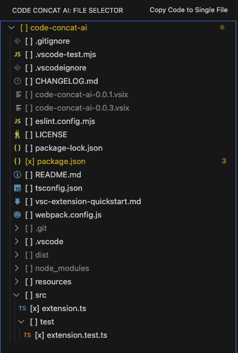
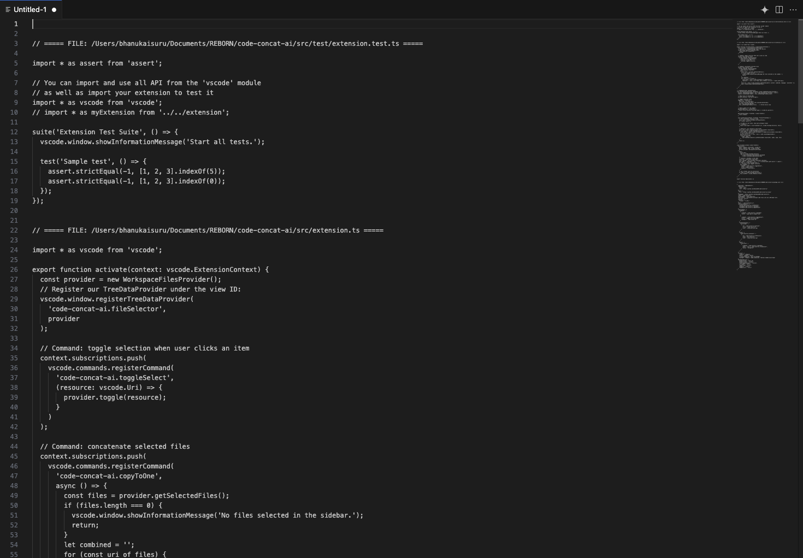

# CodeConcat

**CodeConcat** is a Visual Studio Code extension that helps you quickly combine multiple files from your workspace into a single file. Perfect for sharing code with LLMs (like ChatGPT, Claude, etc.), debugging, or documentation.

---

## 🚀 Features

- 📂 **Side Panel**: Browse and select files from your workspace.
- ✅ **Easy Selection**: Toggle file selection with checkboxes.
- 📋 **One-Click Merge**: Combine selected files into a single editor tab.
- 🔗 **File Headers**: Automatically adds file names as section headers.
- 🔄 **Auto-Refresh**: Tree view automatically updates when files are added, deleted, or modified.

---

## 📸 Preview

### Side Panel View

### Final Result

---

## 🛠 How to Use

1. Open the **CodeConcat** view from the Activity Bar.
2. Browse your project folders and select files using the checkboxes.
3. Click the **"Copy Code to Single File"** button.
4. A new editor tab will open with the combined content, separated by file headers.

---

## 📦 Requirements

- Visual Studio Code `v1.96.2` or newer.

---

## 🐞 Known Issues

- Large file selections may take a few seconds to process.
- File type filters are not yet available (coming soon).

---

## 🙌 Feedback & Contributions

We welcome your feedback and contributions!  
**[GitHub Repo](https://github.com/bhanuka96/code-concat-ai)**

---

**Enjoy using CodeConcat!**